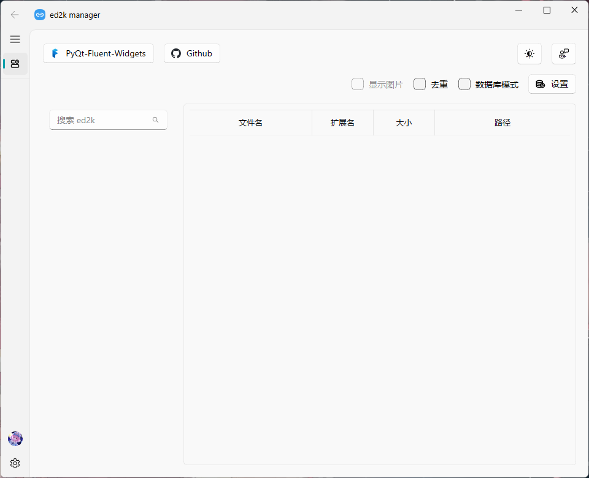
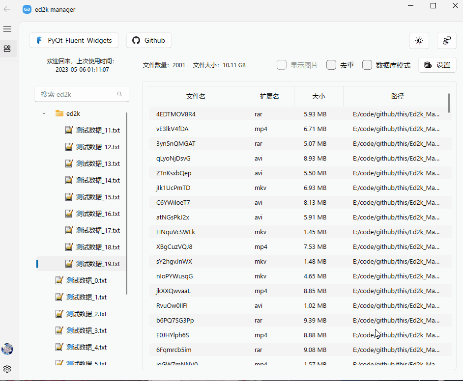
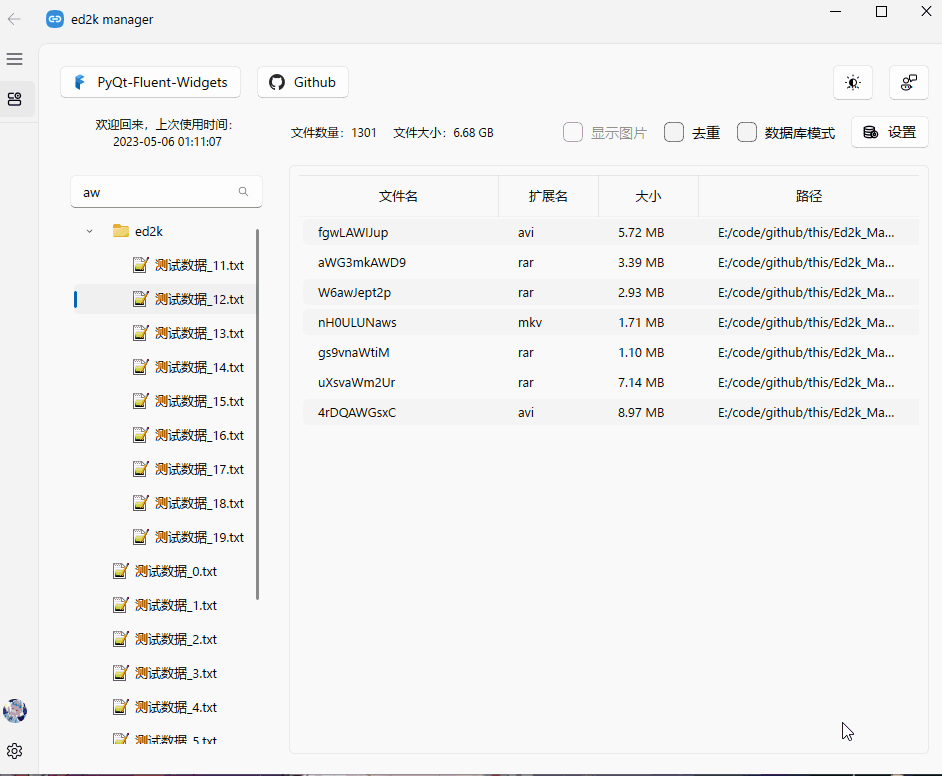

# README

ed2k manager 让链接分享更高效的预览、管理小工具

​​​​

**数据无价，使用本工具前务必做好备份**。

## ‍功能

### 查看

​​​​

### 搜索

​​​​

### 去重

扫描数据库时最新项会覆盖相同哈希的ed2k，谨慎使用此功能。

### 数据库模式

数据存放于`data/database.db`文件内

​​​​​​

### 复制链接

​​​​

### 导出

导出csv和txt至`export`文件夹

​​​​​​

## 使用方式

拖入文件

左侧选择文件

复制

扫描数据库

导出数据库

**可视化操作数据库：**

前往 Github 获取 SQLiteStudio 管理数据库文件

https://github.com/pawelsalawa/sqlitestudio

​​​​

## 下载

​​

115：https://115.com/s/sw6ph5q36ew?password=9898&# 访问码：9898

Github：https://github.com/Ephemeralwanning/Ed2k_Manager/releases

欢迎建议和反馈！！！
